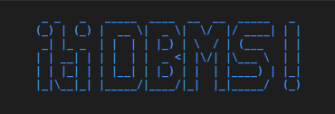
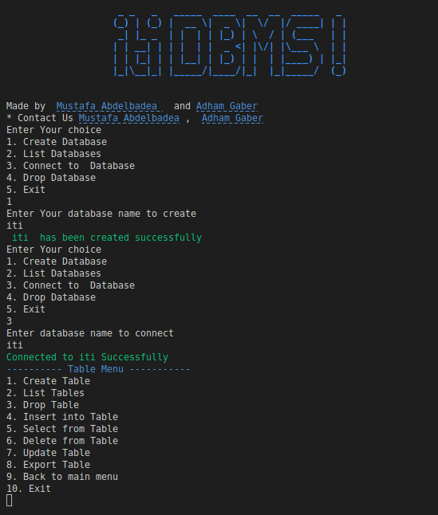
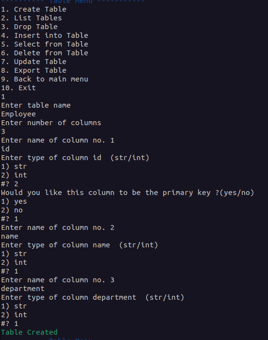
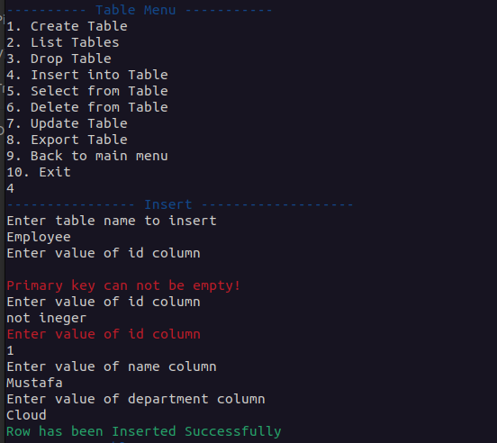
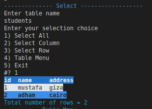
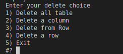
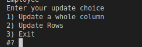
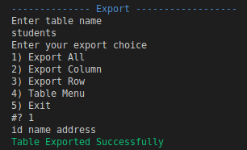
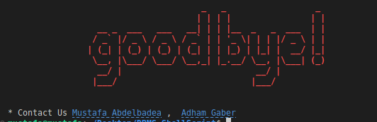

# DBMS-Bash Scripting

<br />
<div align="center">
  <a href="https://github.com/github_username/repo_name">
    
  </a>

<h3 align="center">DBMS-Bash Scripting</h3>

  <p align="center">
    Implementing a databases management system using Bash Shell scripting
    <br />
    <a href="https://github.com/mustafaabdelbadea/DBMS-ShellScript"><strong>Explore the docs »</strong></a>
    <br />
    <br />
    <a href="https://github.com/mustafaabdelbadea/DBMS-ShellScript">View Demo</a>
    ·
    <a href="https://github.com/mustafaabdelbadea/DBMS-ShellScript/issues">Report Bug</a>
    ·
    <a href="https://github.com/mustafaabdelbadea/DBMS-ShellScript/issues">Request Feature</a>
  </p>
</div>

## CLI Main Menu

From the Main menu you can do the following :
* Create Database
* List Datebases
* Connect Database
* Drop Database  
#### You must create at least one Database to Connect.

## Connect Database Menu

After Creating a Database you can do the following :
* Create Table 
* List Tables
* Drop Table
* Insert into Table
* Select From Table
* Delete From Table
* Update Table
* Export Table
* Back to main menu
* Exit
#### You must create at least one table to use these options, you get Error message if table not exist.

<div align="center">
    
</div>

## Key Features

### Create Table
* You must enter number of columns
* Add name for each column
* Select data type for column
* Choose one column as **Primay Key** (If You didn't choose by default last column will be the **Primay Key**)

<div align="center">
    
</div>


### Insert Row
* You must enter data for **Primary Key** can not be empty 
* You must enter valid data as data type
* You can leave non-primary column empty

<div align="center">
    
</div>

### Select 
* Select All table 
* Select Column
* Select Row by statment

<div align="center">
    
</div>

### Delete 
* Delete All table 
* Delete Column
* Delete Rows by statment

<div align="center">
    
</div>

### Update 
* Update Column
* Update Rows by statment

<div align="center">
    
</div>


### Export as JSON Format 
* Export All
* Export Column
* Export Rows by statment

<div align="center">
    
</div>


### Exit 

<div align="center">
    
</div>

## Installation

### Platform & tools
You should use any linux distribution (redhat, ubuntu,etc..) 
### Get the Code

Either clone this repository or fork it on GitHub and clone your fork:

```
git clone https://github.com/mustafaabdelbadea/DBMS-ShellScript.git
cd DBMS-ShellScript
```

## Running
* Run the application

    ```
    chmod u+x ./dbms.sh
    chmod u+x ./colors.sh
    ./dbms.sh
    ```

## Contact

Mustafa Abdelbadea - [@mustafaabdelbadea](https://www.linkedin.com/in/mustafa-abdelbadea/) - mustafa.abdelbadea@gamil.com
</br>
Adham Gaber - [@AdhamGaber](https://www.linkedin.com/in/adhammgaber)

Project Link: [https://github.com/mustafaabdelbadea/DBMS-ShellScript](https://github.com/mustafaabdelbadea/DBMS-ShellScript)
  
